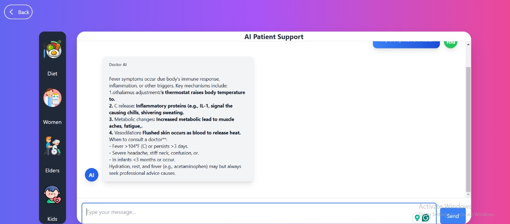
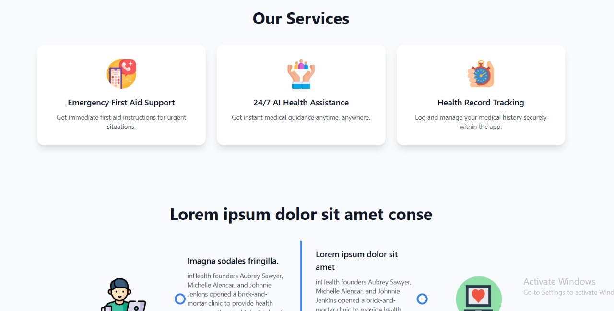
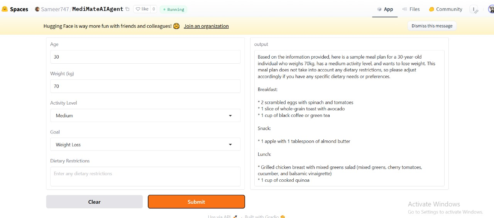
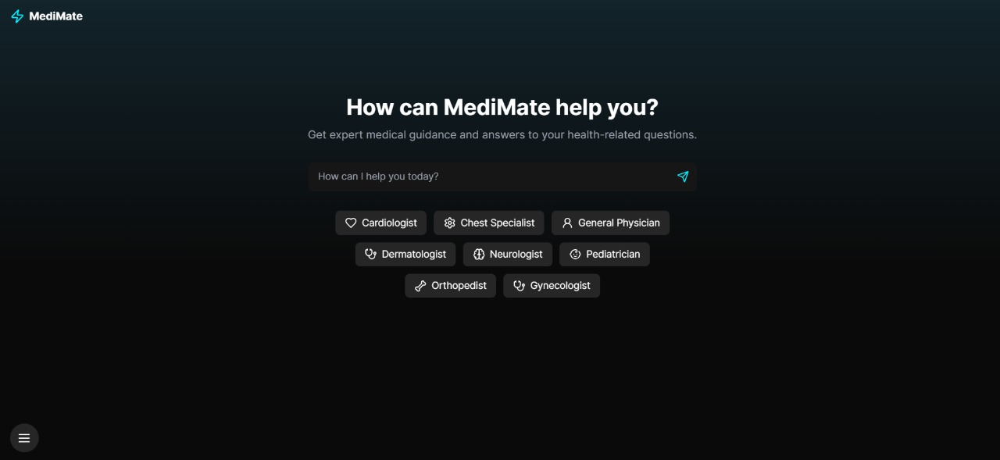

<div align="center">

<p align="center">
  
</p>


# MediMate 🏥

<h3>
  <span style="background: linear-gradient(45deg, #007BFF, #0056b3, #003d80, #002366);
               -webkit-background-clip: text;
               -webkit-text-fill-color: transparent;
               font-size: 1.5em;
               font-weight: bold;">
    Your Ultimate Health Companion
  </span>
</h3>

[](https://github.com/your-username/medimate/stargazers)
[](https://github.com/your-username/medimate/network/members)
[](https://github.com/your-username/medimate/pulls)
[](https://github.com/your-username/medimate/issues)
[](https://github.com/your-username/medimate/blob/master/LICENSE)

<p align="center">
  
</p>

</div>

---

## 🚀 About MediMate

<p align="center">
  
</p>

MediMate is a smart health management platform that enables users to track their medical history, book doctor appointments, and get real-time health updates. Our mission is to provide accessible and reliable healthcare solutions at your fingertips.

### 🌟 Key Features

- 🏥 **Doctor Appointments**: Easily book and manage doctor visits
- 📊 **Health Tracking**: Monitor your vitals and medical history
- 💊 **Medicine Reminders**: Never forget your prescriptions again
- 📍 **Hospital Locator**: Find nearby hospitals and pharmacies
- 💬 **Medical Community**: Share and discuss health concerns
- 🔔 **Emergency Alerts**: Get instant help when needed

---

## 🖼️ Image Gallery

### Featured Screenshots

<p align="center">
  
  
</p>

<p align="center">
  
  
</p>
<p align="center">
  

</p>
---

## 🔗 Visit our App

| Platform | Link |
|----------|------|
| 📱 **Hugging Face** |(https://huggingface.co/spaces/Sameer747/MediMateAIAgent) |
| 🍏 **Full Stack App** | (https://apps.apple.com/app/medimate) |
| 🌍 **Web App** | (https://medi-mate-deep-seek-project-e6ciuj4iy-afeefabatools-projects.vercel.app/) |

---

## Technologies Used

- AI / ML API  
  - DeepSeek R1 Model  
  - DeepSeek V3 API  
  - Groq LLaMA-3.3-70B-Versatile API  
  - Hugging Face  
  - Gradio  
- Frontend  
  - Next.js  
  - TypeScript  
  - Tailwind CSS  
- Backend  
  - Java Spring Boot  


---

## 🚀 Getting Started

To run this project locally:

```bash
# Clone the repository
git clone https://github.com/Afeefa-Batool/MediMate-DeepSeek-Project

# Navigate to the project directory
cd MediMate-DeepSeek-Project

# Install dependencies
npm install

# Start the development server
npm run dev
```

Visit `http://localhost:3000` in your browser to view the website.

---

## 📜 License

This project is licensed under the [MIT License](LICENSE).

---

## 👥 Meet Our Team

<table>
  <tr>
    <td align="center">
      <a href="https://www.linkedin.com/in/contributor1/"><br /><sub><b>Contributor 1</b><br></sub></a><br />
      <a href="https://github.com/contributor1"></a>
    </td>
    <td align="center">
      <a href="https://www.linkedin.com/in/contributor2/"><br /><sub><b>Contributor 2</b><br></sub></a><br />
      <a href="https://github.com/contributor2"></a>
    </td>
    <td align="center">
      <a href="https://www.linkedin.com/in/contributor3/"><br /><sub><b>Contributor 3</b><br></sub></a><br />
      <a href="https://github.com/contributor3"></a>
    </td>
  </tr>
</table>

---

## 💌 Contact Us

For any queries or support, reach out to us at **support@medimate.com** or visit our official website [MediMate](https://medimate.com).

---
