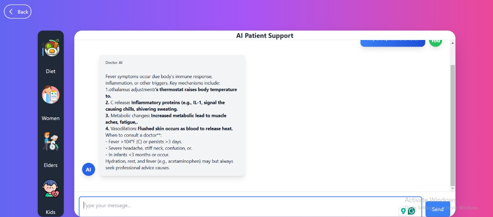
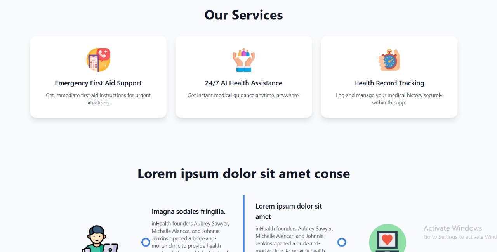
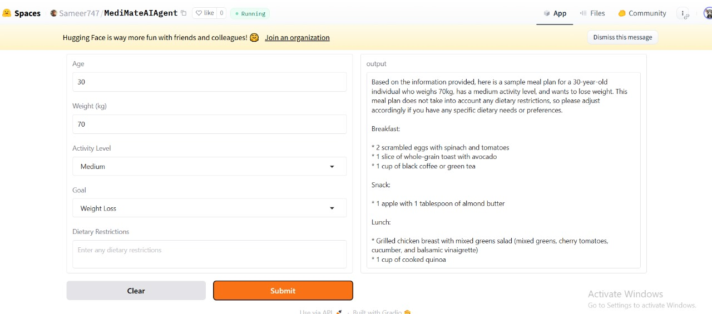
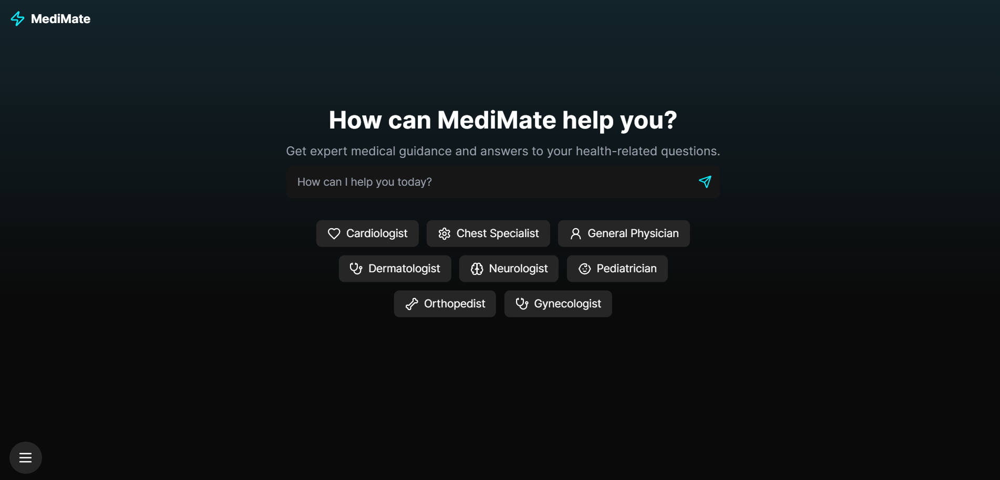

<div align="center">

<p align="center">
  
</p>


# MediMate 🏥

<h3>
  <span style="background: linear-gradient(45deg, #007BFF, #0056b3, #003d80, #002366);
               -webkit-background-clip: text;
               -webkit-text-fill-color: transparent;
               font-size: 1.5em;
               font-weight: bold;">
    Your AI-Powered Health Companion
  </span>
</h3>

[](https://github.com/your-username/medimate/stargazers)
[](https://github.com/your-username/medimate/network/members)
[](https://github.com/your-username/medimate/pulls)
[](https://github.com/your-username/medimate/issues)
[](https://github.com/your-username/medimate/blob/master/LICENSE)

<p align="center">
  
</p>

</div>

---

## 🚀 About MediMate

<p align="center">
  
</p>

MediMate is your personal AI health assistant, designed to provide reliable, instant medical guidance. Whether you're reporting symptoms, seeking advice, or exploring health tips, MediMate uses advanced AI to deliver accurate, easy-to-understand responses. Simply fill out a quick form, and our intelligent chatbot will analyze your condition, offer tailored recommendations, and even guide you through follow-up questions—all in a conversational, user-friendly way. With MediMate, you don’t need to be a medical expert to get the right answers. Stay informed, take control of your health, and experience the future of healthcare at your fingertips. Your well-being, simplified.

### 🌟 Key Features

- 🏥 **Doctor Appointments**: Easily book and manage doctor visits
- 📊 **Health Tracking**: Monitor your vitals and medical history
- 💊 **Medicine Reminders**: Never forget your prescriptions again
- 📍 **Hospital Locator**: Find nearby hospitals and pharmacies
- 💬 **Medical Community**: Share and discuss health concerns
- 🔔 **Emergency Alerts**: Get instant help when needed

---

## 🖼️ Image Gallery

### Featured Screenshots

<p align="center">
  
  
</p>

<p align="center">
  
  
</p>
<p align="center">
  

</p>
---

## 🔗 Visit our App

| Platform | Link |
|----------|------|
| 📱 **Hugging Face** |(https://huggingface.co/spaces/Sameer747/MediMateAIAgent) |
| 🍏 **Full Stack App** | (https://medi-mate-black.vercel.app/) |
| 🌍 **Web App** | (https://medi-mate-deep-seek-project-e6ciuj4iy-afeefabatools-projects.vercel.app/) |

---

## Technologies Used

- AI / ML API  
  - DeepSeek R1 Model  
  - DeepSeek V3 API  
  - Groq LLaMA-3.3-70B-Versatile API  
  - Hugging Face  
  - Gradio  
- Frontend  
  - Next.js  
  - TypeScript  
  - Tailwind CSS  
- Backend  
  - Java Spring Boot  


---

## 🚀 Getting Started

To run this project locally:

```bash
# Clone the repository (Full Stack Web App)
git clone https://github.com/ZilaidAwwab/MediMate

# Navigate to the project directory (For Frontend)
cd MediMate/Frontend

# Install dependencies
npm install

# Start the development server
npm start
```

Visit `http://localhost:3000` in your browser to view the website.

```bash
# Navigate to the project directory (For Backend)
cd MediMate/Backend

# Start the development server
Run the MediMateApplication.java file with Intellij IDEA
```

Visit `http://localhost:8080` in your browser to view the website.

```bash
# Clone the repository (For Next JS App)
git clone https://github.com/Afeefa-Batool/MediMate-DeepSeek-Project

# Navigate to the project directory
cd MediMate-DeepSeek-Project

# Install dependencies
npm install

# Start the development server
npm run dev
```

Visit `http://localhost:3000` in your browser to view the website.

---

## 📜 License

This project is licensed under the [MIT License](LICENSE).

## 💌 Contact Us

For any queries or support, reach out to us at **support@medimate.com** or visit our official website [MediMate](https://medimate.com).

---
